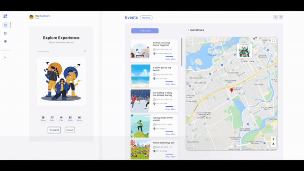
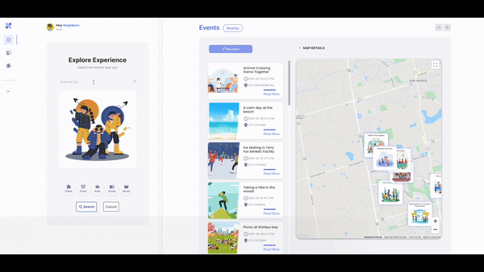
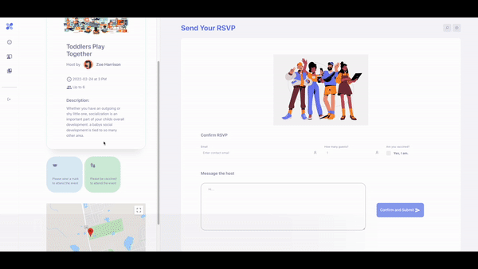
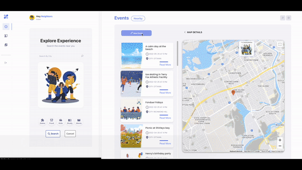
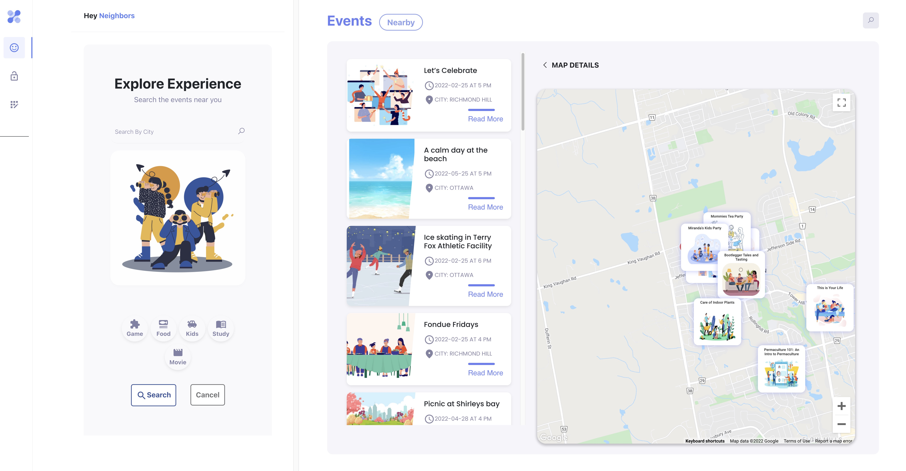

# Hey Neighbors!

Hey Neighbors is a simple application for creating, finding, and arranging events. The App's purpose is to band the community and enhance the connection between neighbors.

## Multiple Positions (user can be an organizer and a participant)
  1. General user: 
    - This App could grab the user's current IP address and automatically provide nearby events on the map.
    - Users can search events by location, date, categories, and other features (require a mask or vaccinated).
    - Users can check event details and send RSVPs to participate in the event.
  2. Organizers (Hostings)
    - Event organizers can review application details and arrange event applications (reject or approve).
    - Organizers can preview events after creating, and managing an event by editing, deleting, and changing status to completed
  3. Participants (Bookings)
    - Participants can check RSVP status, including Pending, Approved, Rejected, Event Cancel, and Event completed.
    - Participants can review incoming events and event history.

## App Demo

- Laning Page and Sign In page

- Home Page and Check Event Details

- Search Events and Join the event

- Event Application (RSVP) Page and Host Processing application

- Create New Event

- Home Page Without Login

## Dependencies

- React
- axios
- bootstrape
- google-map-react
- MUI material
- Node 10.x or above
- NPM 5.x or above
- PG 6.x
- ejs
- express
- cookie-session
- bcrypt
- cors

## Getting Started
- Client
  1. Install dependencies with `npm install`
  2. Running Webpack Development Server `npm start`
- Server
  1. Install dependencies with `npm install`
  2. Following backend server ReadMe document to set-up database 
  3. Running Backend Server `npm run local`
