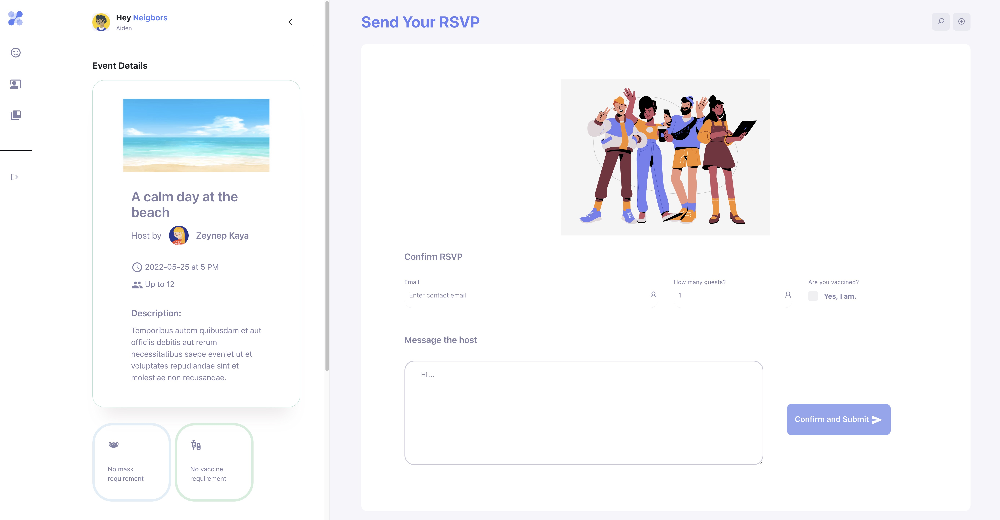

# Hey Neighbors!

The purpose of the app is to band the community and enhance the connection between neighbors.

- (user can be an organizer and a participant)
  - Organizers can easily post events, edit and delete events, mark events as completed, and confirm participants.
  - Participants can search for events they want according to their interests, send requests to participate, etc.
  - This App could grab user's IP address and provide nearby events.

## App Demo

Laning Page

Home Page Without Login

Home Page After Login

Event Details

Event Application Page

Host Page

Booking Page

## Dependencies

- React
- axios
- bootstrape
- google-map-react
- MUI material
- Node 10.x or above
- NPM 5.x or above
- PG 6.x
- ejs
- express
- cookie-session
- bcrypt
- cors
